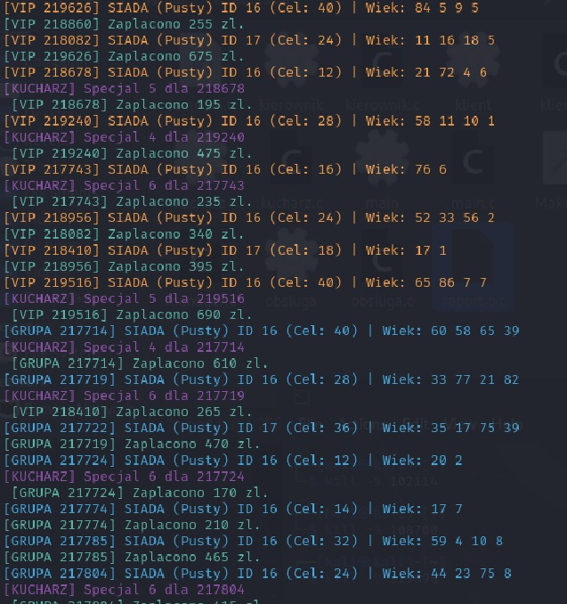
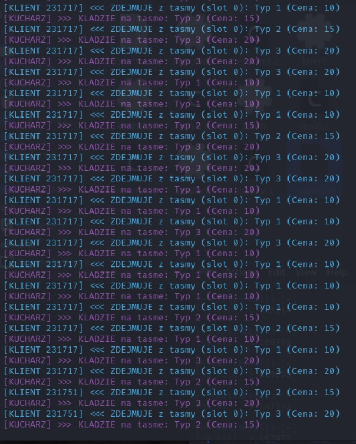
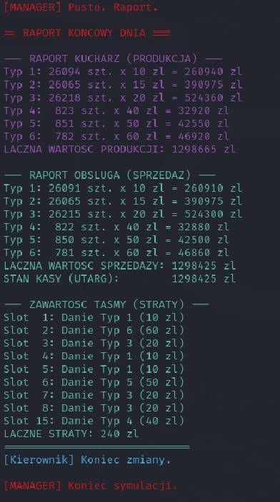

# "Kaiten-Zushi" - Symulacja Restauracji Sushi

# <center>Autor
# <center>Michał Walczyk

<br>

##### Symulacja wieloprocesowej restauracji sushi z taśmą wykorzystująca mechanizmy komunikacji międzyprocesowej (IPC) w systemie Linux.


---
### Użyty kompilator : TORUS

---

## Spis treści
- [Temat projektu](#Temat-projektu)
- [Technologie](#Technologie)
- [Struktura projektu](#Struktura-projektu)


---


## Temat projektu
### Temat 1 Restauracja „kaiten zushi”
##### **Program symuluje działanie restauracji z taśmociągiem według następujących zasad:**


1.   **Infrastruktura:** Lokal posiada taśmę o pojemności $P$ talerzyków oraz stoliki o różnej wielkości (od 1 do 4-osobowych) oraz lade
2.   **Kliencii Grupy:** Do lokalu przychodzą grupy (1-4 os.). Wymagana jest odpowiednia liczba opiekunów dla dzieci (max 3 dzieci na dorosłego).
3. **Kolejkowanie:** Klienci pobierają numerki (stolik/lada). Klienci VIP (max 2%) mają bezwzględne pierwszeństwo w zajmowaniu stolików.
4. **Menu Podstawowe:** Obsługa (Kucharz) losowo umieszcza na taśmie dania w cenach 10, 15, 20 zł.
5. **Konsumpcja:** Klienci zdejmują talerzyki z taśmy, gdy te znajdą się przy ich stoliku (każdy zjada od 3 do 10 dań).
6. **Zamówienia Specjalne:** Klienci mogą zamawiać przez tablet droższe dania (40-60 zł), które kucharz przygotowuje dedykowanie dla konkretnego stolika.
7. **Płatność:** Po zakończeniu posiłku grupa płaci zsumowany rachunek w kasie i opuszcza lokal.
8. **Sterowanie (Kierownik):** System reaguje na sygnały: przyspieszenie pracy kuchni (x2), zwolnienie (50%) oraz natychmiastową ewakuację.
9. **Raportowanie:** Po zamknięciu generowane są statystyki: wyprodukowanych dań, sprzedanych posiłków oraz strat (jedzenie, które zostało na taśmie).
___
## Technologie
* **Język:** `C`
* **Wątki:** `pthreads`
* **IPC:** System V (`Semafory`, `Pamięć Współdzielona`, `Kolejki Komunikatów`)
* **Procesy:** Linux (`fork`, `exec`, `waitpid`)
___
## Struktura projektu

```
kaiten-zushi/
├── common.h        # Definicje, struktury, funkcje pomocnicze
├── main.c          # Manager - inicjalizacja i kontrola symulacji
├── kucharz.c       # Proces kucharza - produkcja dań
├── obsluga.c       # Proces obsługi - taśma i płatności
├── kierownik.c     # Proces kierownika - obsługa sygnałów
├── klient.c        # Proces klienta - konsumpcja (wątki)
├── Makefile        # Reguły kompilacji
├── README.md       # Dokumentacja
└── raport.txt      # Generowany raport (po uruchomieniu)
```
___
## Szczegółowy Opis Działania Programu

Poniżej przedstawiono analizę cyklu życia procesów oraz logikę sterowania zasobami.
### 1.Tworzenie i obsługa plików
- [Mechanizm logowania zdarzeń do pliku raportu](https://github.com/mwalczyk04/Restauracja-kaiten-zushi/blob/b9c4af77f26c68545f4770289887338d8b397401/common.h#L127-L138)
- [Otwieranie/Tworzenie pliku raportu](https://github.com/mwalczyk04/Restauracja-kaiten-zushi/blob/b9c4af77f26c68545f4770289887338d8b397401/main.c#L45)

### 2.Zarządzanie Procesami
- [Uruchamianie procesów personelu](https://github.com/mwalczyk04/Restauracja-kaiten-zushi/blob/b9c4af77f26c68545f4770289887338d8b397401/main.c#L145-L164)
- [Uruchamianie procesów klienta](https://github.com/mwalczyk04/Restauracja-kaiten-zushi/blob/b9c4af77f26c68545f4770289887338d8b397401/main.c#L195-L199)
- [Nadzorowanie życia procesów potomnych](https://github.com/mwalczyk04/Restauracja-kaiten-zushi/blob/b9c4af77f26c68545f4770289887338d8b397401/main.c#L175-L189)
### 3.Obsługa sygnałów i sterowanie
- [Rejestracja funkcji obsługi sygnałów u Kucharza](https://github.com/mwalczyk04/Restauracja-kaiten-zushi/blob/b9c4af77f26c68545f4770289887338d8b397401/kucharz.c#L5-L18)
- [Wysłanie sygnału do procesu](https://github.com/mwalczyk04/Restauracja-kaiten-zushi/blob/b9c4af77f26c68545f4770289887338d8b397401/main.c#L15)
- [Wysłanie sygnału do samego siebie](https://github.com/mwalczyk04/Restauracja-kaiten-zushi/blob/b9c4af77f26c68545f4770289887338d8b397401/main.c#L178-L180)
### 4.Pamięć dzielona
- [Alokacja i dołączenie segmentu pamięci współdzielonej](https://github.com/mwalczyk04/Restauracja-kaiten-zushi/blob/b9c4af77f26c68545f4770289887338d8b397401/main.c#L57-L60)
- [Usunięcie segmentu pamięci](https://github.com/mwalczyk04/Restauracja-kaiten-zushi/blob/b9c4af77f26c68545f4770289887338d8b397401/main.c#L11-L12)
### 5.Synchronizacja
- [Utworzenie zestawu semaforów](https://github.com/mwalczyk04/Restauracja-kaiten-zushi/blob/b9c4af77f26c68545f4770289887338d8b397401/main.c#L63-L68)
- [Wykonanie operacji P lub V na semaforze](https://github.com/mwalczyk04/Restauracja-kaiten-zushi/blob/b9c4af77f26c68545f4770289887338d8b397401/common.h#L113-L120)
### 6.Kolejki komunikatów
- [Wysłanie komunikatu do kolejki](https://github.com/mwalczyk04/Restauracja-kaiten-zushi/blob/b9c4af77f26c68545f4770289887338d8b397401/klient.c#L248-L251)
- [Odbiór komunikatu z kolejki](https://github.com/mwalczyk04/Restauracja-kaiten-zushi/blob/b9c4af77f26c68545f4770289887338d8b397401/kucharz.c#L56-L59)
### 7. Wątki
- [Utworzenie wątku dla osoby w grupie](https://github.com/mwalczyk04/Restauracja-kaiten-zushi/blob/b9c4af77f26c68545f4770289887338d8b397401/klient.c#L255-L265)
- [Oczekiwanie na zakończenie pracy wątku.](https://github.com/mwalczyk04/Restauracja-kaiten-zushi/blob/b9c4af77f26c68545f4770289887338d8b397401/klient.c#L267)
- [Synchronizacja dostępu do zmiennych współdzielonych wewnątrz procesu](https://github.com/mwalczyk04/Restauracja-kaiten-zushi/blob/b9c4af77f26c68545f4770289887338d8b397401/klient.c#L132)

___
## Mapa synchronizacji
### 1. Zestawienie Semaforów
W projekcie wykorzystano zestaw 11 semaforów (System V) do zarządzania dostępem do zasobów krytycznych oraz kolejkowania klientów.
| ID | Typ | Rola w systemie |
| :--- | :--- | :--- |
| **0** | **Mutex** | Chroni sekcję krytyczną pamięci współdzielonej (modyfikacja taśmy i stolików). |
| **1** | **Licznikowy** | Kolejka oczekiwania VIP dla miejsc przy ladzie (rezerwa logiczna). |
| **2**  | **Licznikowy** | Kolejka oczekiwania VIP dla stolików 1-osobowych. |
| **3** | **Licznikowy** | Kolejka oczekiwania VIP dla stolików 2-osobowych. |
| **4** | **Licznikowy** | Kolejka oczekiwania VIP dla stolików 3-osobowych. |
| **5** | **Licznikowy** | Kolejka oczekiwania VIP dla stolików 4-osobowych. |
| **6** | **Licznikowy** | Kolejka oczekiwania Standard dla miejsc przy ladzie. |
| **7** | **Licznikowy** | Kolejka oczekiwania Standard dla stolików 1-osobowych. |
| **8** | **Licznikowy** | Kolejka oczekiwania Standard dla stolików 2-osobowych. |
| **9** | **Licznikowy** | Kolejka oczekiwania Standard dla stolików 3-osobowych. |
| **10**| **Licznikowy** | Kolejka oczekiwania Standard dla stolików 4-osobowych. |
> **Kod:** [Link do pliku](https://github.com/mwalczyk04/Restauracja-kaiten-zushi/blob/b9c4af77f26c68545f4770289887338d8b397401/common.h#L44-L56)

### 2. Typy Komunikatów (Kolejka komunikatów)
Kolejka komunikatów obsługuje dwa niezależne kanały wymiany informacji, rozróżniane polem mtype:
| Typ (`mtype`) | Stała | Kierunek |
| :--- | :--- | :--- |
| **1** | TYP_ZAMOWIENIE | Klient -> Kucharz |  
| **2** | KANAL_PLATNOSCI| Klient <-> Obsługa |

<br>

---
## Testy
Poniżej przedstawiono dowody poprawnego działania systemu w kluczowych scenariuszach.

### **T1: Test priorytetów i logiki VIP**
- **Cel testu:** Sprawdzamy, czy obsługa klientów VIP działa zgodnie z założeniami, czli omijają kolejki, nie zajmują miejsca przy ladzie ,tylko przy stolikach oraz zajmuja cały stolik a nie dosiadają się. Zmiejszamy ilość stołów aby wymusić czekanie i sprawdzenie mechanizmu VIPa
- **Konfiguracja programu:**
  - Zwiększamy szansę na pojawienie się klienta VIP do 50% w `czy_vip`
  - Zmieniamy ilosc stołów w define w common.h na 2 z każdego typu
- **Oczekiwany wynik:**  Oczekujemy zobaczyć w logach programu, że Vip omija kolejke i odrazu zajmuje miejsce jeżeli jest wolny stolik, Natomiast jeżeli wszystkie stoliki sa zajęte VIP czeka w kolejce, ale jest obsłużony priorytetowo i ma pierwszeństwo nad normalnymi klientami do zajęcia stolika jeżeli jakiś się zwolni
- **Wynik** 
<br>

### **T2 Test Problem Klient-Kucharz**
- **Cel testu:** Sprawdzamy zachowanie systemu w sytuacji, gdy Kucharz jest o wiele szybszy od Klienta. Test ma pokazać, że Kucharz nie nadpisuje dań na taśmie, która jest pamięcią dzieloną tylko czeka, gdy taśma jest pełna.
- **Konfiguracja programu**
  -  Ustawiamy rozmiar taśmy  `MAX_TASMA`  na 1
  - > [Odkomentowujemy printf u kucharza](https://github.com/mwalczyk04/Restauracja-kaiten-zushi/blob/b9c4af77f26c68545f4770289887338d8b397401/kucharz.c#L81-L82)
  - > [Odkomentowujemy printf u klienta](https://github.com/mwalczyk04/Restauracja-kaiten-zushi/blob/b9c4af77f26c68545f4770289887338d8b397401/klient.c#L134-L135)
- **Oczekiwany wynik:** Oczekujemy zobaczyć w logach programu, że kucharz zapełnia wszystkie wolne miejsca na taśmie w tym wypadku jedno miejsce, a następnie czeka dopóki klient nie weźmie zamówienia z taśmy.Po zwolnieniu miejsca na taśmie kucharz wraca do pracy do momentu następnego zapełnienia
- **Wynik** 
<br>

### **T3 Test Spójności finansowej**
- **Cel testu:** Sprawdzenie czy system nie gubi żadnych zamówień i pieniędzy. Testowana jest poprawność przesyłania komunikatów `msgrcv` i `msgsnd` między procesami klientów a procesem obsługi
- **Konfiguracja programu:**
  - Nic nie zmieniamy, normalne ustawienia
- **Oczekiwany wynik:** W `raport.txt` lub konsoli na końcu w raporcie musi wyjść równość: <br>
`Wartość produkcji` = `Utarg` + `Wartość zmarnowanego jedzenia na taśmie`
- **Wynik:**
<br>

### **T4 Test logiki współdzielenia stolików**
- **Cel testu:** Sprawdzenie czy semafory i logika programu dotycząca dosiadania się grup równolicznych do stolików jest poprawna
- **Konfiguracja programu:**
  - Nic nie zmieniamy, normalne ustawienia
- **Oczekiwany wynik** W logu będzie można zobaczyć `[GRUPA X] DOSIADA SIE do ID X`. Obie grupy jedzą przy stoliku równocześnie,a stolik zajęty jest całkowicie 4/4
- **Wynik**

<br>

___
## Konfiguracja
<br>

### Użyty kompilator: **TORUS**

### 1.Kompilacja modułów
Projekt można skompilować na dwa sposoby
- wpisując ręcznie komendy:
> #Klonowanie repozytorium <br> `git clone https://github.com/mwalczyk04/Restauracja-kaiten-zushi.git` <p> #Kompilacja programów <br> `gcc -pthread main.c -o main` <br>`gcc kucharz.c -o kucharz`<br> `gcc obsluga.c -o obsluga` <br> `gcc kierownik.c -o kierownik` <br> `gcc klient.c -o klient -pthread`
- używając gotowego pliku Makefile
>#Klonowanie repozytorium <br> `git clone https://github.com/mwalczyk04/Restauracja-kaiten-zushi.git` <p> #Kompilacja za pomocą Makefile <br> `make`

### Uruchomienie symulacji: `./main`
### 2.Sygnały
Przed użyciem sygnałów kierownika należy odkomentować [podany fragment](https://github.com/mwalczyk04/Restauracja-kaiten-zushi/blob/b9c4af77f26c68545f4770289887338d8b397401/kucharz.c#L89)

Program na start wypisuje pid kucharza ale można go też sprawdzić przy pomocy: `pgrep kierownik`

| Akcja| Syngał |
| :--- | :--- |
|Przyspieszenie| SIGUSR1|
|Spowolnienie| SIGUSR2|
|Ewakuacja| Ctrl+C|

